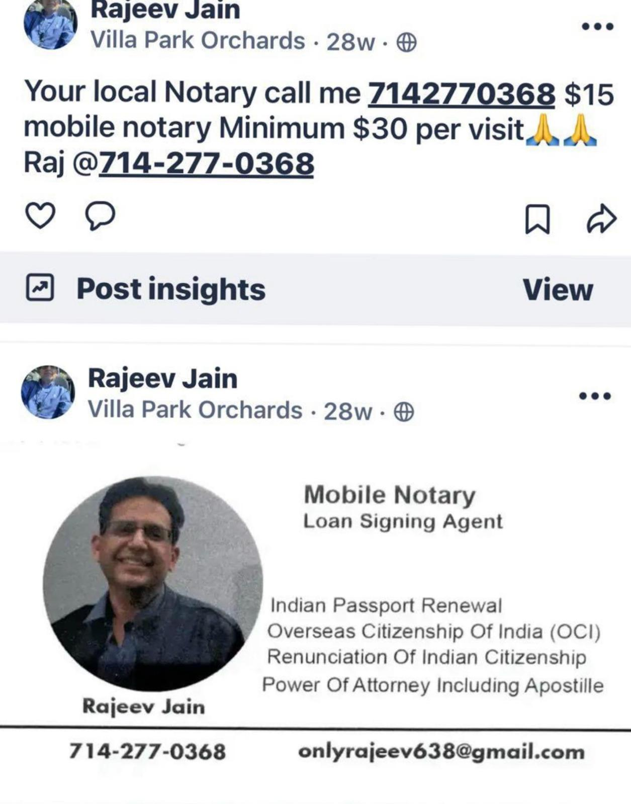

# POA
## reference
- https://visa.vfsglobal.com/usa/en/ind/miscellaneous-services
- https://www.reddit.com/r/nri/comments/1n8v2d8/sending_power_of_attorney_document_from/

## Draft Notes

1️⃣Indian lawyer drafts- Special Power of Attorney and sends pdf.

2️⃣Print on plain white A4 / Letter paper, Print 2 originals (recommended).

3️⃣At UPS / bank / mobile notary:
You carry:
- Printed POA (unsigned), Passport
- Sign POA in front of notary
- Notary: Verifies ID,Stamps & signs, Adds notarial certificate

4️⃣Consulate- CGI–SAN FRANCISCO:

https://www.cgisf.gov.in/page/power-of-attorney-affidavits-relating-to-property-or-financial-matters/
https://visa.vfsglobal.com/usa/en/ind/miscellaneous-services
https://services.vfsglobal.com/one-pager/india/united-states-of-america/miscellaneous-services/#PoA-affidavits

🔹 Step 1: Fill CGI-SF Online Form
- use Passport Seva/CGI-SF Miscellaneous Services portal
- Service category to select- Miscellaneous Services → Attestation of Power of Attorney

🔹 Step 2: Print the Application

- After submitting: Print the application form, Sign it

🔹 Step 3: Prepare the MAIL PACKAGE

- Address: ICAC San Francisco Centre: 642 Harrison Street, Suite 200, San Francisco, CA 94107
  https://services.vfsglobal.com/one-pager/india/united-states-of-america/miscellaneous-services/pdf/PoA-Affidavit-Checklist-Final-July-29.pdf

- Notarized POA – ORIGINAL
- Printed CGI-SF application form
- Photocopy the document, Take original + copy to notary, Notary stamps & signs the copy:
- Passport Notarized copy (first + last page)
- US Visa / I-797 / GC copy notarized copy
- US address proof (DL / utility / bank statement) notarized copy
- Fee payment- VFS Application/Confirmation- Payment receipt
- Reference number
- Self-addressed prepaid return envelope (FedEx / UPS)

💰 Fees (approximate – always reconfirm)
POA attestation: $20, ICWF: $2, VFS: 19, Total: ~$41
Payment is completed online during VFS registration, and only after payment you send the physical packet.
(Paid via Money Order / Cashier’s Check to Consulate General of India, San Francisco)

5️⃣ After you receive POA back from CGI-SF

- Scan & save copy
- Courier ORIGINAL POA to India
- Lawyer does stamping/adjudication in UP (₹100–₹500)
  📌 Only after stamping → POA is fully usable for registration.

---

